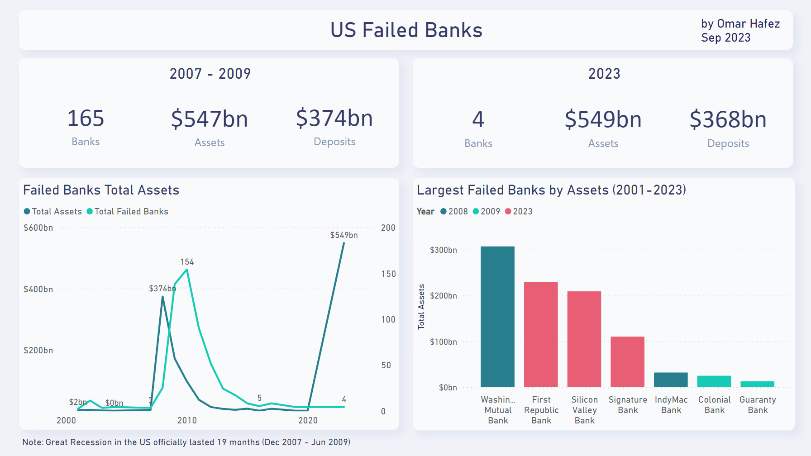

# US Bank Failures Dashboard

## Introduction

This project aims to analyze and visualize bank failures in the United States from the year 2001 to 2023. Data is provided by Federal Deposit Insurance Corporation (FDIC). The dashboard focuses on revealing patterns and trends in bank failures, comparing the 2008 economic crash to the year 2023, and highlighting the largest failed banks based on their assets.

## Dataset

The dataset is sourced from [FDIC](https://www.fdic.gov/bank/historical/bank/index.html) website

Sample from the data:
| Bank Name | City | State | Press Release (PR) | Closing Date | Approx. Asset (Millions) | Approx. Deposit (Millions) | Acquirer & Transaction |
|:---------:|:----:|:-----:|:------------------:|:------------:|:-------------:|:---------------:|:----------------------:|
| The Woodbury Banking Company | Woodbury | GA | PR-069-2016 | Friday, August 19, 2016 | $21,400,000 | $21,100,000 | United Bank has agreed to assume all deposits. |
| The Bank of Georgia | Peachtree City | GA | PR-077-2015 | Friday, October 2, 2015 | $294,200,000 | $280,700,000 | Fidelity Bank has agreed to assume all deposits. |
| Capitol City Bank & Trust Company | Atlanta | GA | PR-016-2015 | Friday, February 13, 2015 | $272,300,000 | $262,700,000 | First-Citizens Bank & Trust Company has agreed to assume all deposits. |

- **Bank Name:** The name of the failed bank.
- **City:** The city where the bank was located.
- **State:** The state where the bank was located.
- **Press Release (PR):** The identifier for the press release issued by the FDIC.
- **Closing Date:** The date when the bank was officially closed.
- **Approx. Asset:** The approximate assets of the bank at the time of failure.
- **Approx. Deposit:** The approximate deposits at the bank at time of failure.
- **Acquirer & Transaction:** Details of the institution that assumed the deposits and possibly other liabilities.

## Tools

| Tool | Logo | Use | Website |
|:----------|:-----|:--------|:--------|
| Power BI | | Clean data & create dashboard | https://powerbi.microsoft.com |

## Data Preprocessing

1. **Data Cleaning:** Columns were organized and separated using Power Query for better usability.

 

2. **Unit Conversion:** "Approx. Asset" & "Approx. Deposit" columns were calculated for better readability.

 

## Results

A comparison between [Great Recession](https://en.wikipedia.org/wiki/Great_Recession) and 2023 shows that despite only 4 banks failed until September, it surpassed the assets of 165 banks failed between 2007 & 2009. It also shows how large are the failed banks in 2023. 

